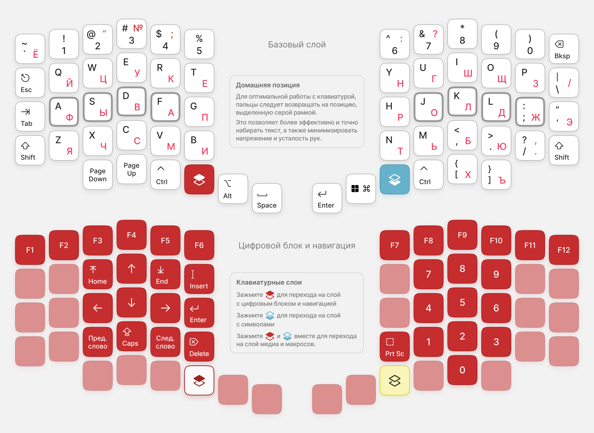

# ErgoHaven Figma Design Documents

These files contain various mockups and layout design for [ErgoHaven](https://ergohaven.xyz/).

### How to use

Just download [`ErgoHaven.fig`](https://github.com/braindefender/ergohaven-figma/raw/master/ErgoHaven.fig) and import it in [Figma](https://www.figma.com/).

### Licence & Attribution

The documents are licensed under [CC BY-SA 4.0](https://creativecommons.org/licenses/by-sa/4.0/).

The documents are using [SF Symbols 5.0](https://www.figma.com/community/file/886999666531731323/sf-symbols-5-0-5296-svg-icons).